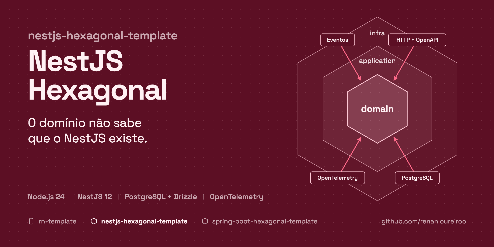
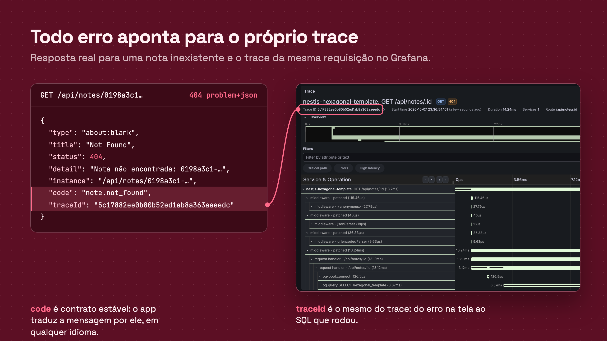

# NestJS Hexagonal Template

<!-- template:start -->



[](https://github.com/renanloureiroo/nestjs-hexagonal-template/actions/workflows/ci.yml)


**Um backend NestJS em que o domínio não sabe que o NestJS existe: casos de uso puros, erros com
contrato estável, banco de verdade nos testes e telemetria desde o primeiro request.**

A maioria dos projetos NestJS começa com regra de negócio dentro de `@Injectable()`, entidade do
ORM circulando até o controller e testes que mockam o repositório. Funciona até a primeira troca
de banco, de protocolo ou de time. Este template começa do outro jeito: o núcleo é TypeScript
puro, o framework fica na borda e o ESLint quebra o build quando alguém tenta misturar os dois.

[**→ Use this template**](https://github.com/renanloureiroo/nestjs-hexagonal-template/generate)

## Por que usar

- **Núcleo sem framework.** `core`, `domain` e `application` são TypeScript puro. Importar
  `@nestjs/*`, Drizzle, `pg`, `class-validator` ou uma pasta `infra` ali quebra `npm run verify`.
- **Casos de uso de verdade.** Uma classe sem decorator, um método `execute`, `Input` e `Output`
  próprios. O cabeamento fica num `useFactory` explícito no módulo, no papel do `@Bean`.
- **Domínio sempre válido.** Entidades com `create` e `restore`, ids tipados e value objects que
  validam as invariantes no construtor. Caso de uso não repete validação.
- **Transações declarativas sem vazar infraestrutura.** `@Transactional()` é um decorator puro do
  núcleo; a transação corrente é propagada por `AsyncLocalStorage`, e adaptadores nunca a recebem
  por parâmetro.
- **Eventos de domínio depois do commit.** Agregados registram eventos, a publicação acontece só
  depois do commit e um rollback os descarta.
- **Erros como contrato público.** Toda falha sai em RFC 9457 (`application/problem+json`) com
  `code` estável, `traceId` e erros por campo. O mapa de `ErrorType` para status HTTP não compila
  enquanto faltar um tipo.
- **Testes que confiam no banco real.** Fakes para as portas (mocks sobre portas do projeto são
  proibidos), Vitest nos testes de unidade e E2E com Testcontainers e PostgreSQL de verdade.
- **Observabilidade de série.** OpenTelemetry auto-instrumentado. `npm run dev` sobe PostgreSQL e
  Grafana LGTM, com logs, métricas e traces ao lado da API.
- **OpenAPI completo.** Swagger UI com todos os status possíveis documentados, inclusive os de erro.
- **Migrations versionadas e checadas.** Geradas pelo drizzle-kit, aplicadas no boot e validadas por
  `db:check` no portão de entrega.
- **Pronto para agentes de código.** `AGENTS.md`, documentação prescritiva, ADRs e as skills do
  [Spec Kit](https://github.com/github/spec-kit) dão a qualquer agente as mesmas regras que o time
  segue.

## Veja funcionando



Uma busca por nota inexistente devolve RFC 9457 com `code` estável e `traceId`. O mesmo id
abre o trace da requisição no Grafana que o `npm run dev` sobe junto com a API.

## O que vem pronto

| Área            | Escolha                                                                |
| --------------- | ---------------------------------------------------------------------- |
| Runtime         | Node.js 24 LTS, ESM e TypeScript estrito                               |
| Framework       | NestJS 12 sobre Express, class-validator e `@nestjs/swagger`           |
| Persistência    | PostgreSQL, Drizzle ORM e migrations SQL do drizzle-kit                |
| Eventos         | `@nestjs/event-emitter`, entregues depois do commit                    |
| Observabilidade | OpenTelemetry com auto-instrumentação e Grafana LGTM no Docker Compose |
| Testes          | Vitest, Supertest e Testcontainers                                     |
| Qualidade       | ESLint com regras de arquitetura, Prettier e CI no GitHub Actions      |
| Entrega         | Dockerfile e health check                                              |
| Documentação    | arquitetura, estratégia de testes, ADRs e `AGENTS.md`                  |

## Arquitetura em 30 segundos

```text
infra  ─────►  application  ─────►  domain
  │                                      ▲
  └────────────────►  core  ◄────────────┘
```

```text
requisição ─► DTO validado ─► controller ─► caso de uso ─► domínio
                                                 │
                                                 ▼
                              porta ─► adaptador Drizzle ─► PostgreSQL
                                                 │
resposta HTTP ◄─ presenter ◄─ output ◄───────────┘
```

Cada contexto de negócio é um módulo em `src/modules/<contexto>`, com `domain`, `application` e
`infra` próprios. Módulos não importam o domínio uns dos outros: quando um precisa de outro,
declara uma porta. O passo a passo está em [docs/ARCHITECTURE.md](docs/ARCHITECTURE.md).

## Uma família de templates

| Template                                                                                           | Stack                       | Papel      |
| -------------------------------------------------------------------------------------------------- | --------------------------- | ---------- |
| **nestjs-hexagonal-template** (este)                                                               | Node.js 24, NestJS, Drizzle | API        |
| [spring-boot-hexagonal-template](https://github.com/renanloureiroo/spring-boot-hexagonal-template) | Java 21, Spring Boot, JPA   | API        |
| [rn-template](https://github.com/renanloureiroo/rn-template)                                       | Expo, React Native          | app mobile |


Os dois backends têm a mesma arquitetura, os mesmos contratos HTTP, os mesmos códigos de erro e
os mesmos tipos de teste. O time escolhe a linguagem que domina sem abrir mão do desenho, e o app
mobile lê os erros de qualquer um dos dois sem adaptação.

## Comece em um minuto

1. Clique em
   [**Use this template**](https://github.com/renanloureiroo/nestjs-hexagonal-template/generate) e
   dê ao repositório o nome do serviço, por exemplo `orders-service`.
2. Espere o workflow `template-init` (cerca de 30 s): ele renomeia pacote, imagem, banco e título
   da API a partir do nome do repositório.
3. Clone e rode:

   ```bash
   cp .env.example .env
   npm install
   npm run dev
   ```

Em seguida, abra o Swagger em `http://localhost:8080/api/swagger-ui` e o Grafana em
`http://localhost:3000`. Os detalhes estão em [Usando como template](#usando-como-template).

---

<!-- template:end -->

Backend Node.js 24 com NestJS, arquitetura modular, PostgreSQL, Drizzle, OpenTelemetry, Vitest e
Testcontainers.

O módulo `example` implementa uma API pequena de notas para mostrar o caminho
completo: domínio → caso de uso → porta → Drizzle → HTTP. Ele deve ser removido ou
renomeado quando o primeiro contexto real for criado.

## Requisitos

- Node.js 24 (`nvm use`);
- Docker;
- Docker Compose.

## Rodando localmente

Crie a configuração local a partir do exemplo:

```bash
cp .env.example .env
npm install
npm run dev
```

`npm run dev` sobe o `compose.yaml` (PostgreSQL e Grafana LGTM) e inicia a
aplicação em modo watch. As migrations são aplicadas no boot. A aplicação fica
disponível em:

- API: `http://localhost:8080/api`;
- Swagger UI: `http://localhost:8080/api/swagger-ui`;
- OpenAPI JSON: `http://localhost:8080/api/v3/api-docs`;
- Health: `http://localhost:8080/api/health`;
- Grafana: `http://localhost:3000`.

Exemplo:

```bash
curl -i -X POST http://localhost:8080/api/notes \
  -H 'Content-Type: application/json' \
  -d '{"title":"Minha primeira nota"}'
```

A listagem é paginada e devolve as notas mais recentes primeiro:

```bash
curl -s 'http://localhost:8080/api/notes?page=0&size=20'
# {"items":[{"id":"…","title":"Minha primeira nota","createdAt":"…"}],"total":1}
```

## Testes

```bash
npm test
npm run verify
npm run test:unit
npm run test:e2e
```

Os testes E2E exigem Docker e são ignorados quando ele não está disponível. Veja
[docs/TESTS.md](docs/TESTS.md).

## Migrations

Depois de alterar um arquivo `*.schema.ts`:

```bash
npm run db:generate -- --name descricao_da_mudanca
```

O arquivo gerado em `drizzle/` é versionado e nunca editado depois de aplicado.

## Imagem da aplicação

```bash
docker build -t nestjs-hexagonal-template .
```

A imagem lê `DATABASE_URL`, `PORT`, `API_DOCS_ENABLED`, `LOG_LEVEL` e as variáveis
`OTEL_*` do ambiente.

<!-- template:start -->

## Usando como template

Clique em **Use this template** e dê ao repositório o nome do projeto, por exemplo
`orders-service`. No primeiro push, o workflow `template-init` renomeia tudo a
partir desse nome e commita o resultado:

| Item                              | Exemplo para `orders-service` |
| --------------------------------- | ----------------------------- |
| `name` do `package.json` e imagem | `orders-service`              |
| `OTEL_SERVICE_NAME`               | `orders-service`              |
| Banco e usuário locais            | `orders_service`              |
| Título da API                     | `Orders Service API`          |

Aguarde o workflow terminar (aba **Actions**, cerca de 30 s) antes de clonar.

Para inicializar localmente, depois de clonar:

```bash
scripts/init-template.sh orders-service
```

Depois da inicialização:

1. ajuste `description` no `package.json`;
2. remova ou renomeie `src/modules/example`, `test/modules/example` e sua migration;
3. substitua este README pela apresentação do produto;
4. revise as decisões abertas em `docs/ARCHITECTURE.md` e registre as que forem tomadas em
   `docs/adr`.

<!-- template:end -->

## Documentação

- [Arquitetura](docs/ARCHITECTURE.md)
- [Testes](docs/TESTS.md)
- [Decisões de arquitetura (ADRs)](docs/adr/README.md)
